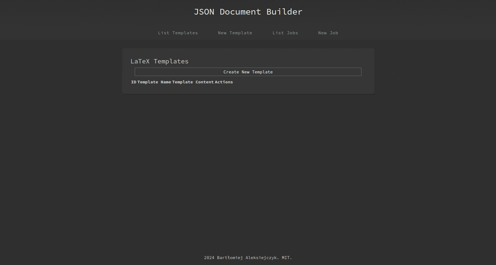

# Resume Builder Application

This application generates documents from JSON data and Jinja2-to-LaTeX templates, allowing for dynamic creation of professional-looking documents.



## How to Run It Locally

### Prerequisites

- Docker and Docker Compose must be installed on your machine. Installation guides for Docker can be found [here](https://docs.docker.com/get-docker/) and for Docker Compose [here](https://docs.docker.com/compose/install/).

### Setup

1. Clone the repository to your local machine:

```bash
git clone https://github.com/bartlomiej-aleksiejczyk/JsonResumeBuilder.git
cd JsonResumeBuilder
```

### Running the Application

To start the Resume Builder application using Docker Compose, follow these steps:

1. **Open a Terminal**: Navigate to the root directory of the project where your `docker-compose-dev.yml` file is located.

2. **Start the Services**: Execute the following command to start all the services defined in the `docker-compose-dev.yml` file. This includes your application, as well as any databases or message brokers you've defined as services:

   ```bash
   docker compose -f docker-compose-dev.yml up --build
   ```

3. **Access the Application**: Once the containers are up and running, you can access the Resume Builder application by opening your web browser and navigating to:

   ```
   http://localhost:8080/springboot-resume-builder
   ```

### Default Credentials

Upon accessing the Resume Builder, use the following default credentials to log in:

- **Username**: admin
- **Password**: password

These credentials provide administrative access to the application. For security, consider changing these as soon as possible after initial setup.

### Sample Data

For demonstration purposes, the sample data used in the application can be found in the file `/demonstration/SampleData.md`. Refer to this file for examples of JSON data and Latex-to-Jijna2 template for use with the application.

By following these steps, you'll be able to run and interact with the Resume Builder application locally using Docker Compose. For further customization or development, refer to the specific service configurations within your `docker-compose-dev.yml` file.

## License

This project is licensed under the MIT License.
